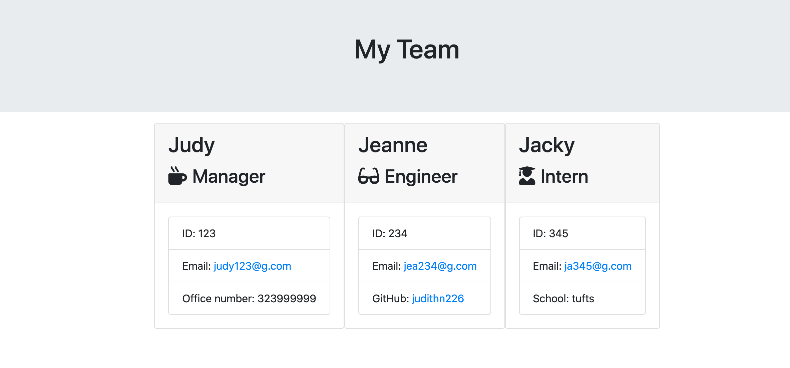

# Team Profile Generator

### Description

One of the most important aspects of programming is writing code that is readable, reliable, and maintainable. Oftentimes, _how_ we design our code is just as important as the code itself. In this homework assignment, your challenge is to build a Node CLI that takes in information about employees and generates an HTML webpage that displays summaries for each person. Since testing is a key piece in making code maintainable, you will also be ensuring that all unit tests pass.

## User Story

```
As a manager
I want to generate a webpage that displays my team's basic info
so that I have quick access to emails and GitHub profiles
```

## APP Demo


## APP HTML OUTPUT



## Minimum Requirements

- Functional application.

- GitHub repository with a unique name and a README describing the project.

- User can use the CLI to generate an HTML page that displays information about their team.

- All tests must pass.

### User input

The project must prompt the user to build an engineering team. An engineering
team consists of a manager, and any number of engineers and interns.

## Installation Process

In order to install the app dependencies run:
npm i

In order to use the Team Profile Generator, cd into the Develop folder and run:
node app.js

To test the Team Profile Generator run:
npm run test
